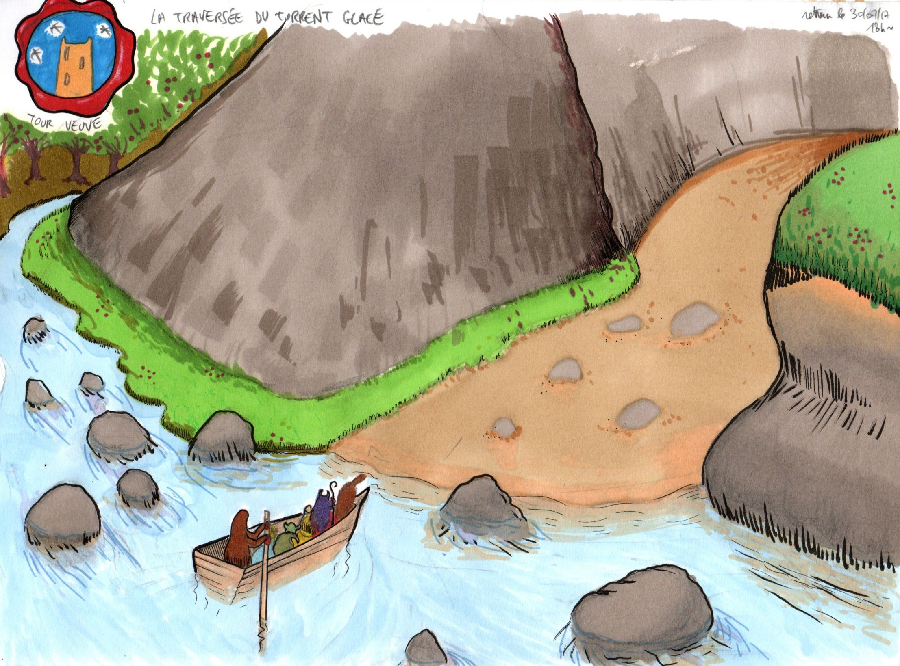
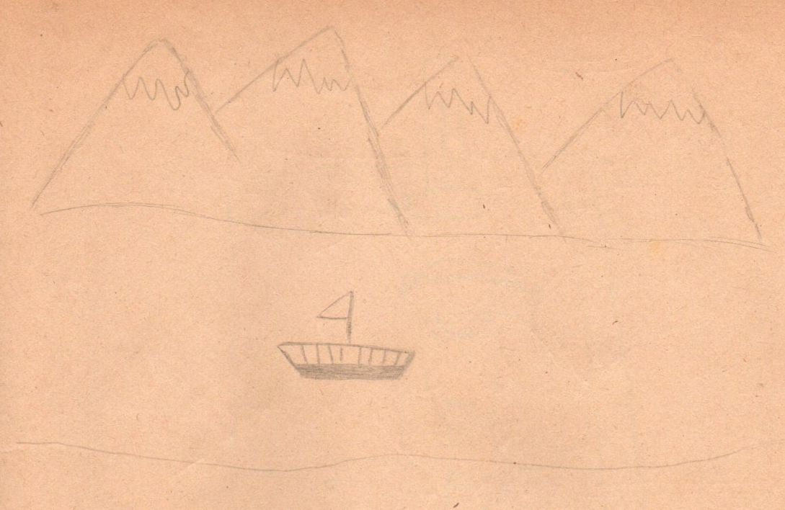
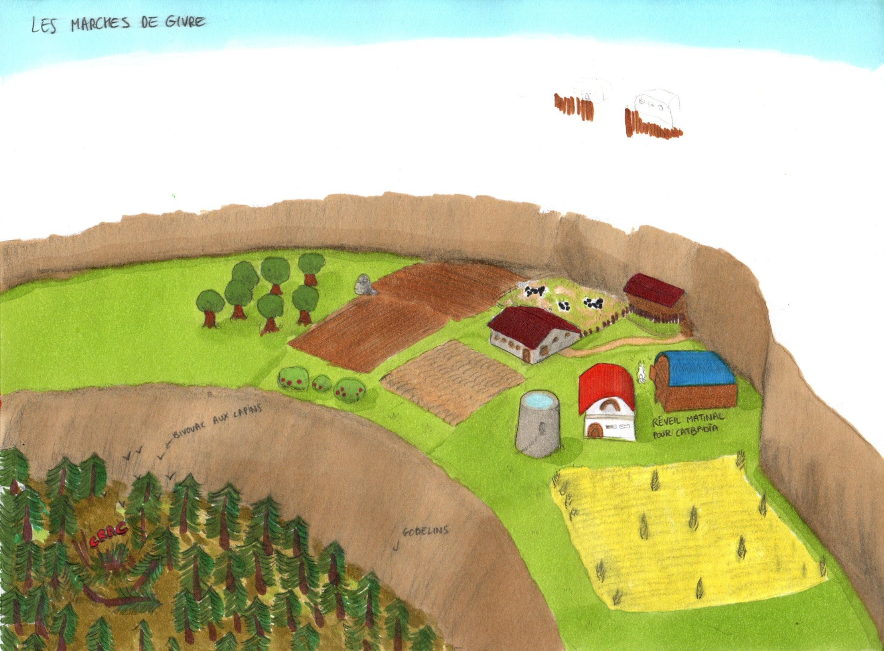
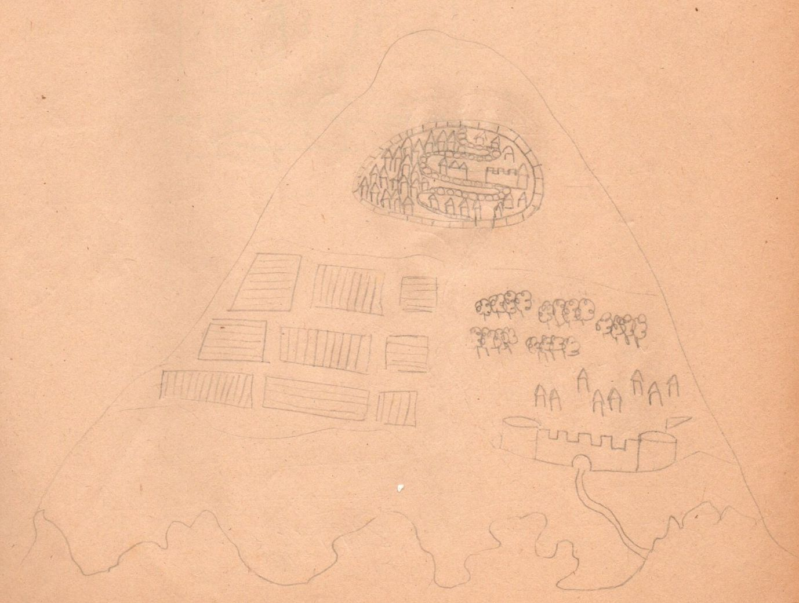
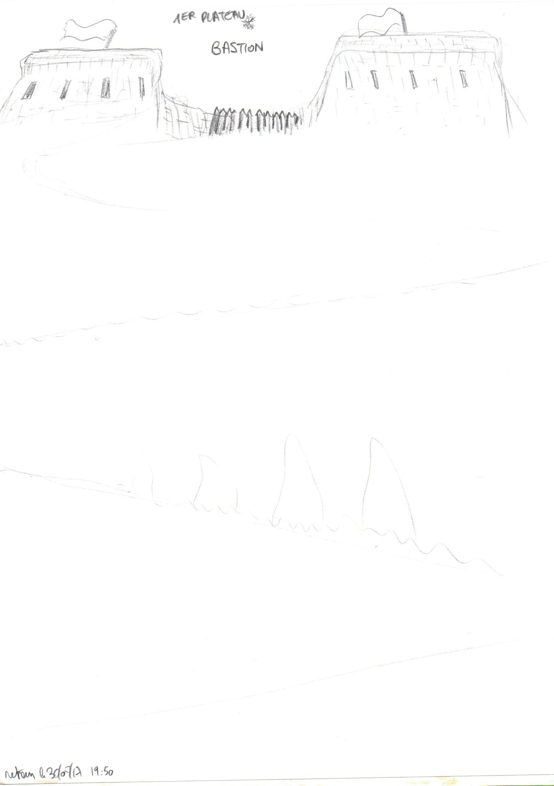
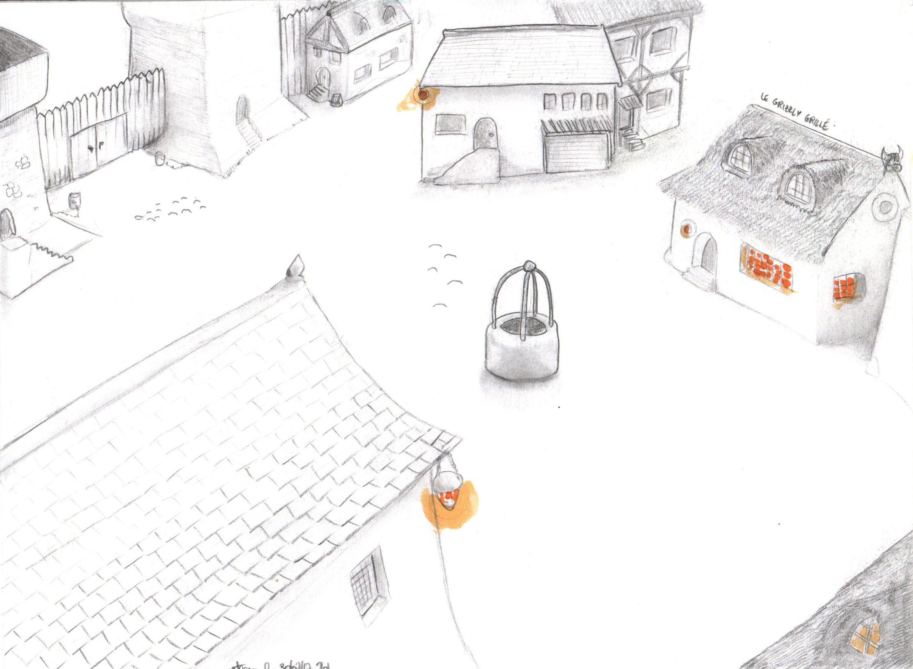

## La traversée du Torrent Glacé

Première étape de notre aventure dans le monde des Chroniques Oubliées.

Je ne me rappelle plus si c'était une barque ou même carrément un voilier...

## Les marches de givre

Ça rigole moins quand ça commence à cailler.

En fait les marches de givre portent ce nom car c'est une sorte de montage avec plusieurs plateaux.

## Premier plateau

Le bastion.

## Le Grizzly Grillé

Enfin une petite pause pour souffler un peu (et boire).
